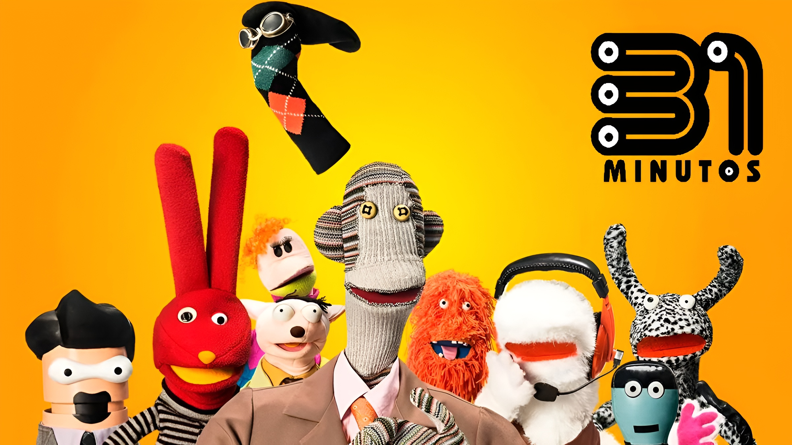
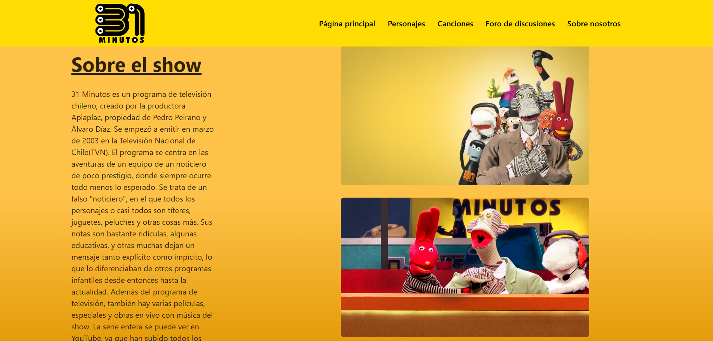
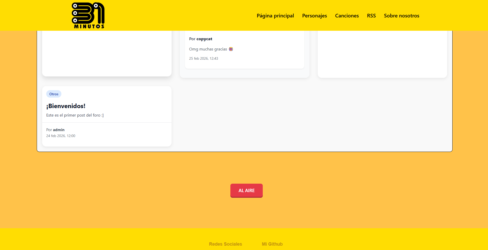
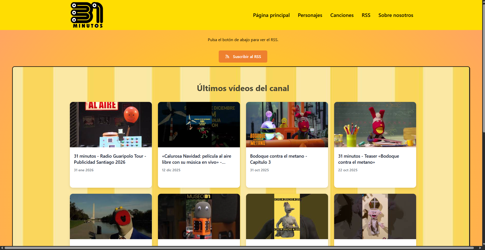
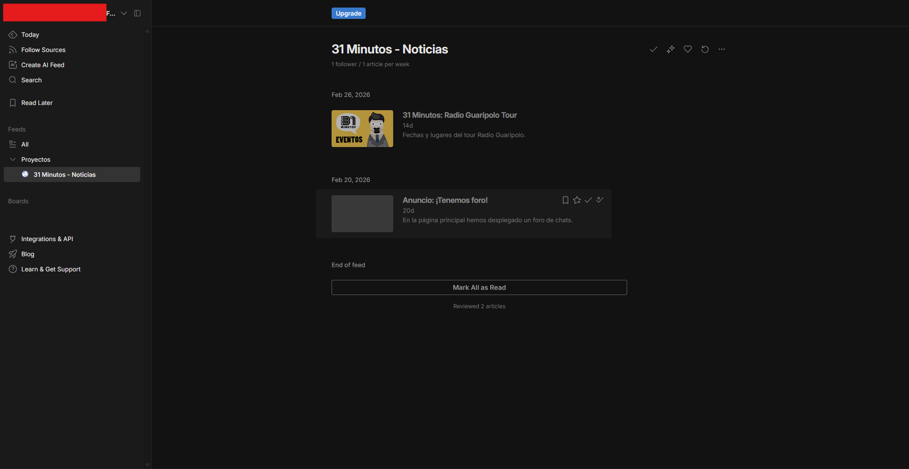

# 31 Minutos Webpage
<!-- TABLE OF CONTENTS -->

  
Table of Contents

  <ol>
    <li>
      <a href="#about-the-project">About The Project</a>
      <ul>
        <li><a href="#built-with">Built With</a></li>
      </ul>
    </li>
    <li>
      <a href="#getting-started">Getting Started</a>
      <ul>
        <li><a href="#prerequisites">Prerequisites</a></li>
        <li><a href="#installation">Installation</a></li>
      </ul>
    </li>
    <li><a href="#license">License</a></li>
    <li><a href="#acknowledgments">Acknowledgments</a></li>
  </ol>

<!-- ABOUT THE PROJECT -->
## About The Project

This project is a webpage made using React and Vite, based off the chilean TV series 31 Minutos. It contains four pages that can be navigated across and interacted with, which hold information about the show itself, its characters, some of the original songs featured in it, and a fake About Us for the productors of this wonderful show.
This page also has a forum in the /chatroom subpage, which is linked to a firebase cloud server and an RSS that shows the Youtube channel's recent videos and shorts.
### About The Project: Homepage

The homepage in this webpage contains information about the show itself, along with a few images. Along with it, there are five cards that directly link to the channel's 4 season's playlists.
There is also a forum everyone can post in if they log in/create an account.
Along with it, and as the last thing in the homepage is a small red button that plays one of the most recurrent phrases in the show ("¡Tulio, estamos al aire!"/"Tulio, we're on air!") 

### About the Project: RSS Feed

Since there are no official nor unofficial RSS feeds about the series (or at least, none according to what I've searched), I have made an RSS feed of my own with a news relating to the page and another RSS news with info about the series' tour dates.
In order to view it, click the button and copy the link to your RSS Feed viewer of choice!

(<a href="#readme-top">back to top</a>)

### About the Project: Third-party Components

The third party components used in this webpage are the following:
- 
- 

(<a href="#readme-top">back to top</a>)

## Built With
- 
- 
- 
- 

(<a href="#readme-top">back to top</a>)

<!-- GETTING STARTED -->
## Getting Started

### Installation

The original repo of this page is privated due to privacy concerns. Therefore, if you wish to check out this page please do use the link of the hosted webpage:

https://proy-chatroom-31m.web.app

If you wish to contact me in order to view the code, feel free to do so by opening a pull. (👍ᐛ )👍

(<a href="#readme-top">back to top</a>)

<!-- LICENSE -->
## License
Distributed under no license.
All images, song embeds and other things used in this page belong to their rightful owners: [Aplaplac](https://aplaplac.cl)  
If you want to support this project, please support their 31 Minutos youtube channel. 
© Aplaplac 2026 - All rights reserved

(<a href="#readme-top">back to top</a>)

<!-- ACKNOWLEDGMENTS -->
## Acknowledgments

* [A few parts of the design are loosely based off this design template](https://dribbble.com/shots/19803245-Web-design-Header-Exploration)
* [othneildrew's Best README Template](https://github.com/othneildrew/Best-README-Template.git)
* [ms-aija's LeafletReact5MinDemo](https://github.com/ms-aija/LeafletReact5minDemo.git)
* [React Leaflet](https://react-leaflet.js.org/)
* [Leaflet](https://leafletjs.com/)
* [Img Shields](https://shields.io)
* [CSS Gradient - Generator, Maker, and Background](https://cssgradient.io/)
* [Font Awesome](https://fontawesome.com)
* [React Icons](https://react-icons.github.io/react-icons/search)
* [31 Minutos' Fandom wiki](https://31minutos.fandom.com/wiki/Portada)
* And lastly, [Aplaplac](https://aplaplac.cl/page/3)

No Figma page has been used to base the design off. The inspiration came from these two pages:
* [The official 31 Minutos website](https://31minutosoficial.cl/)
* [The official Aplaplac website](https://aplaplac.cl/page/3/)

(<a href="#readme-top">back to top</a>)
